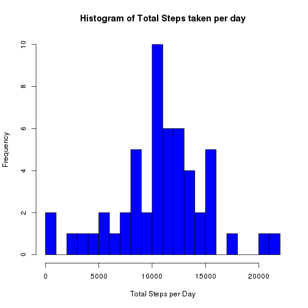
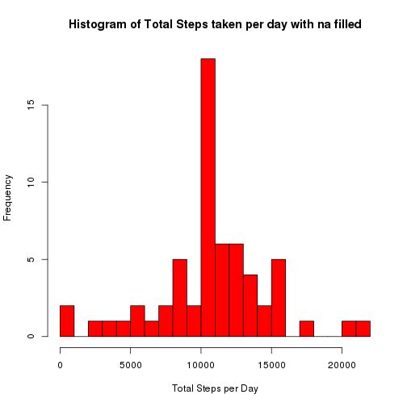
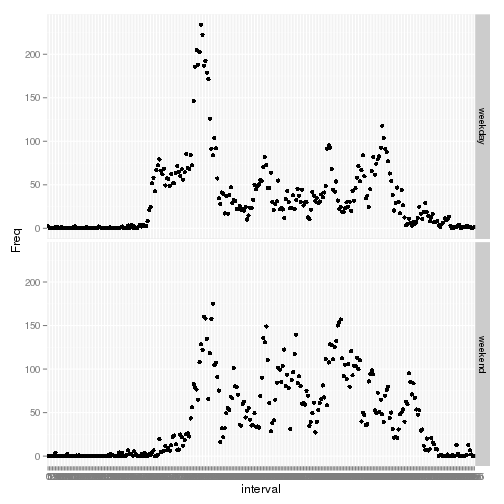

# Reproducible Research: Peer Assessment 1

This assignment makes use of data from a personal activity monitoring device. This device collects data at 5 minute intervals through out the day. The data consists of two months of data from an anonymous individual collected during the months of October and November, 2012 and include the number of steps taken in 5 minute intervals each day. The variables included in this dataset are:  
-    steps: Number of steps taking in a 5-minute interval (missing values are coded as NA)  
-    date: The date on which the measurement was taken in YYYY-MM-DD format  
-    interval: Identifier for the 5-minute interval in which measurement was taken  
The dataset is stored in a comma-separated-value (CSV) file and there are a total of 17,568 observations in this dataset.

## Loading and preprocessing the data

1. Download the data file if not already downloaded
2. Unzip and read as a data frame.
3. The interval column is converted to factor type.
4. The date column is converted to Date type.
5. The data is examined by using summary and str methods on it.


```r
# download and read the data, convert columns for convenience
read_data <- function() {
    fname = "/tmp/activity.zip"
    if(!file.exists(fname)) {
        source_url = "https://d396qusza40orc.cloudfront.net/repdata%2Fdata%2Factivity.zip"
        download.file(source_url, destfile=fname, method="curl")
    }
    con <- unz(fname, "activity.csv")
    tbl <- read.csv(con, header=T, colClasses=c("numeric", "character", "numeric"))
    tbl$interval <- factor(tbl$interval)
    tbl$date <- as.Date(tbl$date, format="%Y-%m-%d")
    tbl
}
tbl <- read_data()
```


```r
summary(tbl)
```

```
##      steps            date               interval    
##  Min.   :  0.0   Min.   :2012-10-01   0      :   61  
##  1st Qu.:  0.0   1st Qu.:2012-10-16   5      :   61  
##  Median :  0.0   Median :2012-10-31   10     :   61  
##  Mean   : 37.4   Mean   :2012-10-31   15     :   61  
##  3rd Qu.: 12.0   3rd Qu.:2012-11-15   20     :   61  
##  Max.   :806.0   Max.   :2012-11-30   25     :   61  
##  NA's   :2304                         (Other):17202
```

```r
str(tbl)
```

```
## 'data.frame':	17568 obs. of  3 variables:
##  $ steps   : num  NA NA NA NA NA NA NA NA NA NA ...
##  $ date    : Date, format: "2012-10-01" "2012-10-01" ...
##  $ interval: Factor w/ 288 levels "0","5","10","15",..: 1 2 3 4 5 6 7 8 9 10 ...
```

## What is mean total number of steps taken per day?

```r
steps_per_day <- aggregate(steps ~ date, tbl, sum, na.rm = TRUE)
colnames(steps_per_day) <- c("date", "steps")
mean_steps = mean(steps_per_day$steps)
median_steps = median(steps_per_day$steps)
hist(steps_per_day$steps, col = "blue", xlab = "Total Steps per Day", ylab = "Frequency", 
    main = "Histogram of Total Steps taken per day", breaks=20)
```

 
  
The **mean** total number of steps taken per day is 1.0766 &times; 10<sup>4</sup> steps.  
The **median** total number of steps taken per day is 1.0765 &times; 10<sup>4</sup> steps.  

## What is the average daily activity pattern?
1. Make a time series plot (i.e. `type = "l"`) of the 5-minute
   interval (x-axis) and the average number of steps taken, averaged
   across all days (y-axis).
2. Which 5-minute interval, on average across all the days in the
   dataset, contains the maximum number of steps?


```r
steps_per_interval <- aggregate(steps ~ interval, data=tbl, mean, na.rm = TRUE)
colnames(steps_per_interval) <- c("interval", "steps")
plot(steps ~ interval, data=steps_per_interval, type="l", xlab = "Time Intervals (5-minute)", 
    ylab = "Mean number of steps taken (all Days)", main = "Average number of Steps Taken at different 5 minute Intervals")
lines(steps ~ interval, data=steps_per_interval, type = "l")
```

 

```r
max_step_interval=steps_per_interval$interval[which.max(steps_per_interval$steps)]
steps_at_max_step_interval=steps_per_interval[max_step_interval,"steps"]
```
The interval with maximum number of steps is 835  with 206.1698 steps.

## Imputing missing values
- Calculate and report the total number of missing values in the dataset (i.e. the total number of rows with NAs). This was also shown in the summary.

```r
sum(is.na(tbl$steps))
```

```
## [1] 2304
```
- Devise a strategy for filling in all of the missing values in the dataset. The strategy does not need to be sophisticated. For example, you could use the mean/median for that day, or the mean for that 5-minute interval, etc.  
The strategy is to replace missing step values with the mean for a given 5-minute interval across the entire observation period.

```r
tbl$steps2 = tbl$steps
for (i in 1:length(tbl$steps)) if (is.na(tbl$steps[i])) {
    tbl$steps2[i] = mean(tbl$steps, na.rm = TRUE)
}
head(tbl)
```

```
##   steps       date interval steps2
## 1    NA 2012-10-01        0  37.38
## 2    NA 2012-10-01        5  37.38
## 3    NA 2012-10-01       10  37.38
## 4    NA 2012-10-01       15  37.38
## 5    NA 2012-10-01       20  37.38
## 6    NA 2012-10-01       25  37.38
```
- Create a new dataset that is equal to the original dataset but with the missing data filled in.

```r
tblNew = data.frame(steps = tbl$steps2, date = tbl$date, interval = tbl$interval)
```
- Make a histogram of the total number of steps taken each day and Calculate and report the mean and median total number of steps taken per day. Do these values differ from the estimates from the first part of the assignment? What is the impact of imputing missing data on the estimates of the total daily number of steps?

```r
steps_per_day_new <- aggregate(steps ~ date, tblNew, sum)
colnames(steps_per_day_new) <- c("date", "steps")
mean_steps = mean(steps_per_day_new$steps)
median_steps = median(steps_per_day_new$steps)
hist(steps_per_day_new$steps, col = "red", xlab = "Total Steps per Day", ylab = "Frequency", 
    main = "Histogram of Total Steps taken per day with na filled", breaks=20)
```

 

The **mean** total number of steps taken per day is 1.0766 &times; 10<sup>4</sup> steps.  
The **median** total number of steps taken per day is 1.0766 &times; 10<sup>4</sup> steps.  
The Mean is same as when compared to the first part of the assignment. The Median is slightly lower.  
The histogram shows a similar shape as before with overall higher frequencies due to the NA being replaced in the new histogram. See also this side by side plot:

```r
library(ggplot2)
par(mfrow = c(1, 2))
hist(steps_per_day$steps, main = "NA present", xlab = "total number of steps taken each day", breaks=20)
hist(steps_per_day_new$steps, main = "NA replaced with mean", xlab = "total number of steps taken each day", breaks=20)
```

 

## Are there differences in activity patterns between weekdays and weekends?
1. Create a new factor variable in the dataset with two levels – “weekday” and “weekend” indicating whether a given date is a weekday or weekend day.
2. Make a panel plot containing a time series plot (i.e. type = "l") of the 5-minute interval (x-axis) and the average number of steps taken, averaged across all weekday days or weekend days (y-axis).

```r
day = weekdays(tbl$date)
dayType = vector()
for (item in day) {
    if (item == "Saturday" || item == "Sunday") {
        dayType = append(dayType, "weekend")
    } else {
        dayType = append(dayType, "weekday")
    }
}
tbl$dayType = factor(dayType)
avgStepsNew = data.frame(xtabs(steps ~ interval + dayType, aggregate(steps ~ 
    interval + dayType, tbl, mean)))
qplot(interval, Freq, data = avgStepsNew, facets = dayType ~ .)
```

 

Activity on the weekends tends to be more spread out over the day compared to the weekdays. This is probably because activities on weekdays mostly follow a work related routine, whereas activity on weekends is with relaxed schedule.
